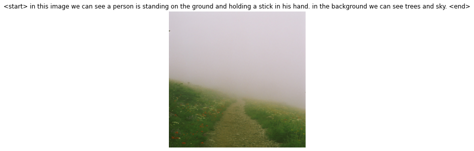
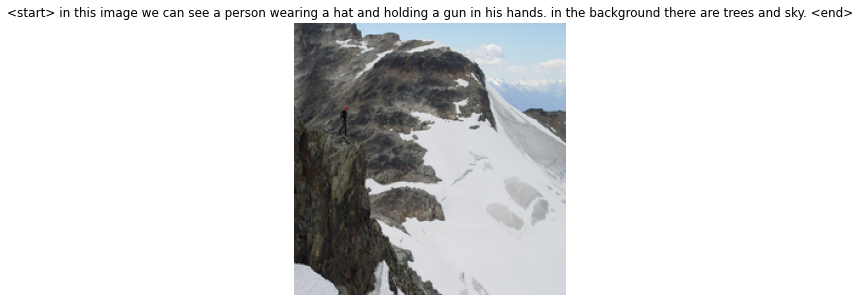
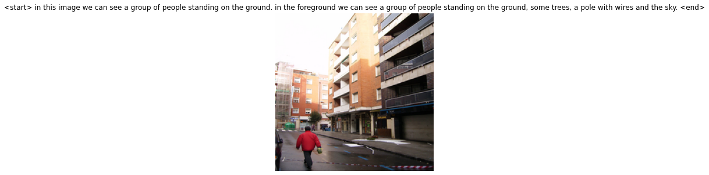
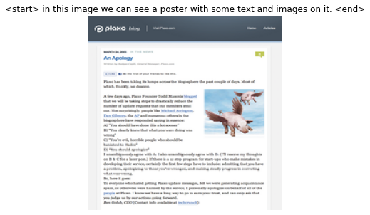
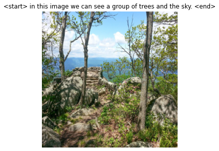

# img2capt-Deep-Learning-Image-Caption-Generator
Final Assignment for Deep Learning course, semester A, 2020, at IDC, taught by Dr. Kfir Bar.

## Examples:
The following are a few examples of captions added to images. For a better description, read the attached PDF.

### Captions 1 and 5:
These images perform poorly. While they manage to identify the sky, non existing elements are also described: In image 1, the caption depicts a non existing person holding a stick. In image 5, the caption successfully recognizes a single person, but it also adds a non existing gun in his hand. Interestingly, image 5 also successfully predicted that the person is a man, by using the word 'his' to describe his hands.

### Caption 2:
Caption 2 performs adequately. It succeeds in describing all elements in the image, even less apparent elements that require zooming in.

### Caption 3:
Caption 3 misclassi•es a webpage for a poster. Nevertheless, it does correctly recognize text and images, and it does not add non-existing elements.

### Caption 4:
Caption 4 o•ers the shortest description of all captions. Nevertheless, it does not depict non-existing elements, and there is beauty in brevity.

